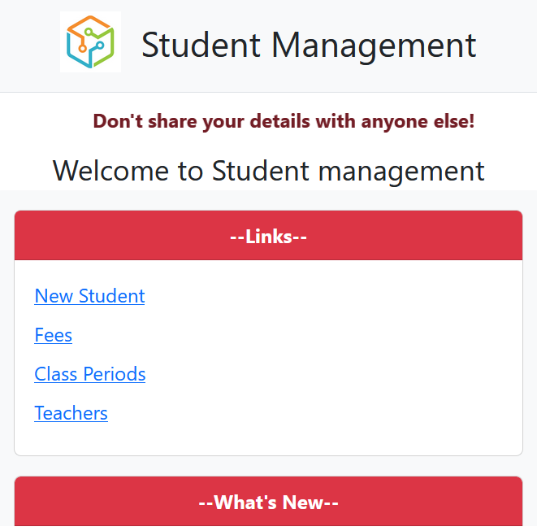
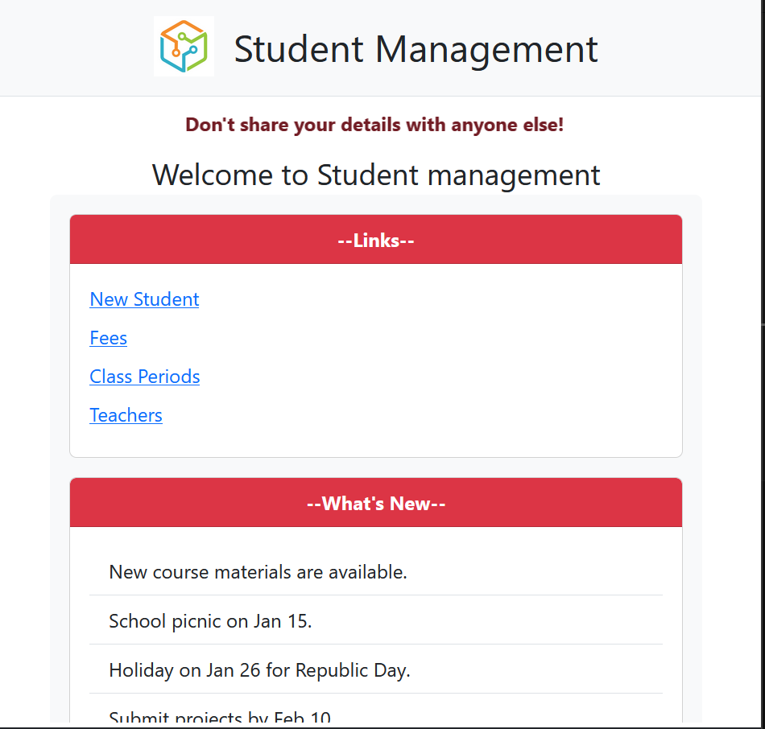

# Student Management Page

This project is a **Student Management Page** created using **HTML**, **CSS**, **Bootstrap**, and **JavaScript**. It is designed to provide a responsive and interactive interface for managing student details efficiently. 

---

## Features
- **Responsive Design**: Built to ensure the page adapts seamlessly to various screen sizes, including desktops, tablets, and mobile devices.  
- **Form Validation**: Includes JavaScript-based validation with clear alerts for incomplete or incorrect inputs using SweetAlert2.  
- **Interactive Elements**: Dropdown menus, input fields, and gender selection with dynamic feedback.  
- **Scrollable Content**: Provides a scrollable "What's New" section for recent updates and notices.  
- **Marquee Text**: Displays an animated marquee banner for important announcements.  
- **Reusable Footer**: Integrated footer using an `iframe` for consistency across pages.  

---

## Technologies Used
- **HTML5**: For structuring the webpage.  
- **CSS3**: For styling and custom animations.  
- **Bootstrap 5**: For responsive layouts, pre-styled components, and enhanced design.  
- **JavaScript**: For interactivity and form validation.  
- **SweetAlert2**: For user-friendly alert messages and feedback.  

---

## How to Use
1. Clone the repository to your local machine:  
   ```bash
   git clone https://github.com/your-username/student-management-page.git

## Features Breakdown

### 1. **Marquee Text**
- Adds an animated scrolling text for announcements like "Don't share your details with anyone else!"

### 2. **Form Validation**
- Validates fields like `Name`, `Roll Number`, `Mother’s Name`, `Father’s Name`, `Phone Numbers`, and `Date of Birth`.
- Provides user-friendly alerts for incorrect inputs using **SweetAlert2**.

### 3. **Sections**
- **Left Sidebar**: Contains quick links to features like "New Student", "Fees", and "Class Periods".
- **Main Form**: Central section for entering student details.
- **Right Section**: Additional input fields for parent details and class/section selection.

### 4. **Dynamic Interactions**
- Gender selection triggers an info alert to confirm the choice.
- Real-time validation checks ensure all fields are filled correctly before form submission.

---

## Future Improvements
- Add functionality to save form data using JavaScript or integrate with a backend.
- Introduce search and filter options for the student list.
- Add a dashboard page for detailed student management.

## Screenshots

### Form General look Example:


### Responsive Design:



### links column:


### Sweet alerts Example:


## Conclusion

The **Student Management System** project demonstrates the use of **HTML**, **CSS**, and **Bootstrap** to create a responsive, user-friendly, and visually appealing interface. This project also highlights the importance of integrating form validation and interactive features using **JavaScript** and libraries like **SweetAlert2**.

By exploring this repository, you can learn:
- How to structure a basic web application.
- How to enhance design and usability with Bootstrap.
- How to implement form validation and responsive designs effectively.

We hope this project serves as a stepping stone for those new to web development. Contributions and suggestions are welcome to help improve and expand this project!

---

Thank you for visiting! 


